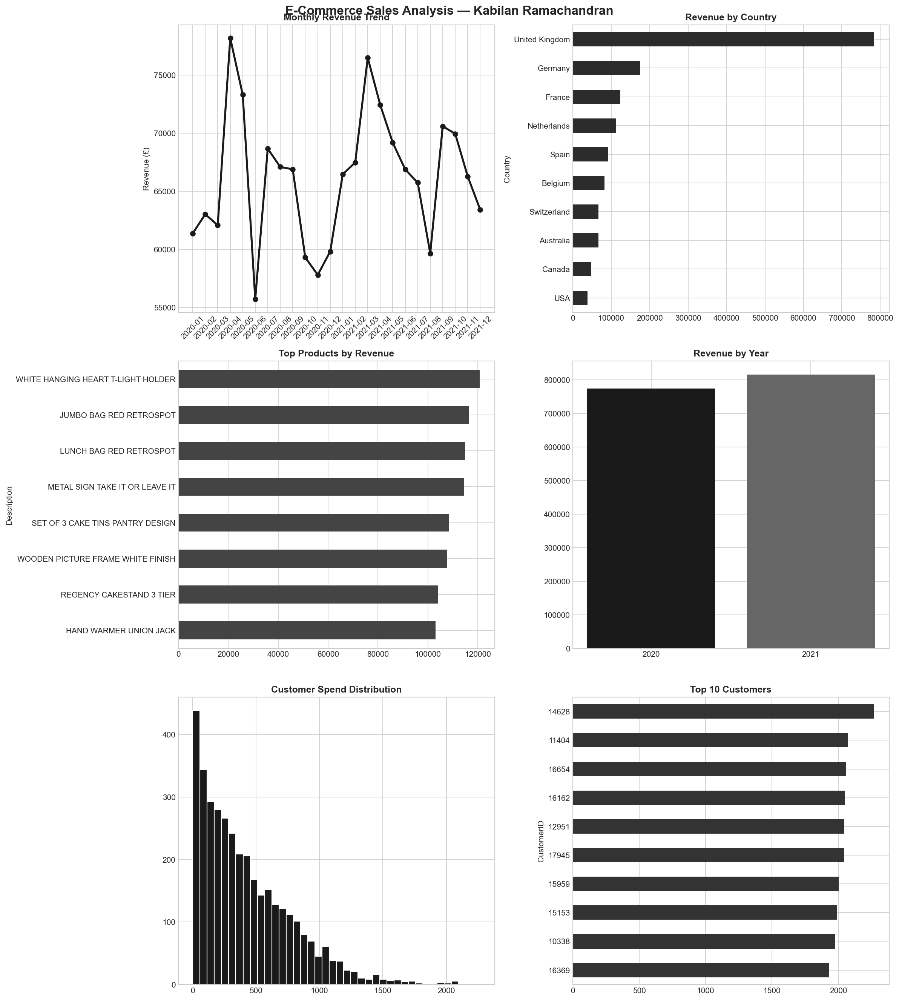

# E-Commerce Sales Analysis — Python EDA

## Project Overview
End-to-end exploratory data analysis of 5,000 e-commerce 
transactions using Python — uncovering revenue trends, 
top markets, best-selling products, and customer behaviour.

## Tools & Skills
- Python — Pandas, NumPy, Matplotlib, Seaborn
- Data Cleaning — NULL detection, data type handling
- EDA — GroupBy, aggregations, distribution analysis
- Data Visualisation — 6-chart professional dashboard

## Key Business Insights
- 🇬🇧 UK = 49.3% of total revenue (£783,677)
- 🇩🇪 Germany = #2 international market at 11.0% (£175,376)
- 📈 Revenue grew from £773K (2020) to £814K (2021) — +5.3% YoY
- 🏆 Top product: WHITE HANGING HEART T-LIGHT HOLDER = £120,682
- 👥 3,655 unique customers | Avg spend £421 | Top customer £2,267
- ⚠️ 149 missing CustomerIDs identified and flagged for data quality

## Dashboard

## Author
**Kabilan Ramachandran**  
linkedin.com/in/kabilan-ramachandran  
github.com/kabilanramachandran
